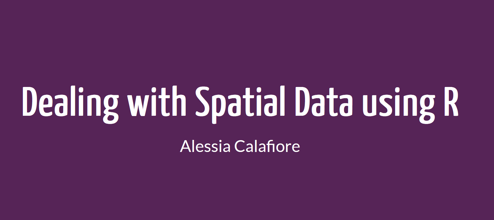

# Rladies Edinburgh



The presentation is made with Quarto powered by the fantastic [beatrizmilz/quarto-rladies-theme](https://github.com/beatrizmilz/quarto-rladies-theme) template and all code is easily reproducible.

Before running the code, make sure you have the following R packages installed:

```
install.packages(c("sf","tidyverse","ggrepel","ggspatial","leaflet"))
```
